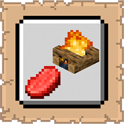

# Campfire GUI

  

   
A lightweight mod that adds an inspection GUI to campfires.

## Functionality

  

   
- Inspection Screen: Shift + right-click any campfire or soul campfire to open a read-only management screen.
- Cooking Slots: Displays all four cooking slots with the item currently inside each one.
- Live Countdown Timers: Each slot shows a live countdown timer with the seconds remaining.
- Animated Flame: An animated flame reflects whether the campfire is lit or not.
- Soul Campfire Support: The title reads Campfire or Soul Campfire depending on the block type, with matching flame textures.
- Slot Tooltips: Hovering over a slot shows a tooltip with the item name and exact time remaining in seconds.
- Non-Intrusive: Regular right-clicking is unaffected and keeps its vanilla behavior.

## Benefits

  

   
- No more guessing or manually timing your campfire cooking — everything is visible at a glance.
- Supports all four slots simultaneously so nothing gets overlooked.
- Works with both campfires and soul campfires out of the box.
- Completely non-intrusive — vanilla interactions are fully preserved.

## Installation

  

   
1.  **Requirements**: Ensure you have Minecraft 1.21.10, Fabric Loader 0.18.4, and the Fabric API installed.
2.  **Download**: Get the latest `.jar` from [Modrinth](https://modrinth.com/mod/campfire-gui) or [CurseForge](https://www.curseforge.com/minecraft/mc-mods/campfire-gui).
3.  **Setup**: Drop the file into your `%appdata%/.minecraft/mods` folder.

## Support

  

   
If you encounter bugs or wish to contribute:
* [Report any problems you find.](https://github.com/armaninyow/Campfire-GUI/discussions/categories/issues)
* [Share your ideas for new features.](https://github.com/armaninyow/Campfire-GUI/discussions/categories/suggestions)

## Credits

  

   
* **Author**: Armaninyow
* **License**: Released under [CC0-1.0](https://creativecommons.org/publicdomain/zero/1.0/).

